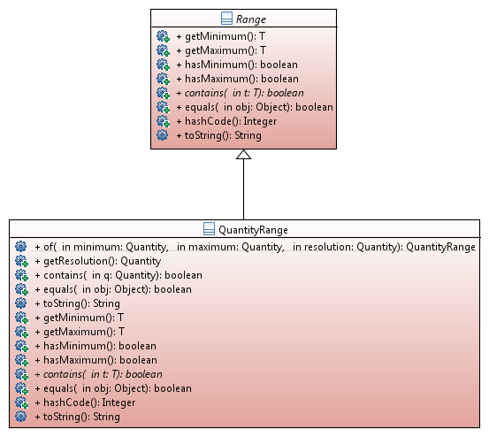

## Range Class
<code>Range</code> is a compromise between much broader and complex approaches like Google Guava and a too narrow and limited <code>ValueRange</code> type [[JSR-310](GLOSSARY.html#JSR-310)] added to Java 8 (something like <code>TemporalRange</code> could have been a better name there, because it uses another specific type <code>TemporalField</code> and is therefore useless outside the Temporal context) The generic base type Range is suitable for cases where one does not know the exact parameterized quantity type, e.g. results of operations like divide() or multiply() when asType() cannot be applied.
The specialized subclass <code>QuantityRange</code> is somewhat modeled after definitions in [OGC_OM] and has slight similarities with the <code>MeasurementRange</code> class from [JSR-256] but using Generics which were not available at the time.

